## Decomposition of graphs

### 3.1 Why graphs?

#### 3.1.1 How is a graph represented?

##### How big is your graph?

#### 3.2 Depth-first search in undirected graphs

#### 3.2.1 Exploring mazes

#### 3.2.2 Depth-first search

#### 3.2.3 Connectivity in undirected graphs

#### 3.2.4 Previsit and postvisit orderings

#### 3.3 Depth-first search in directed graphs

#### 3.3.1 Types of edges

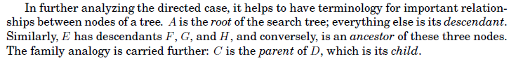
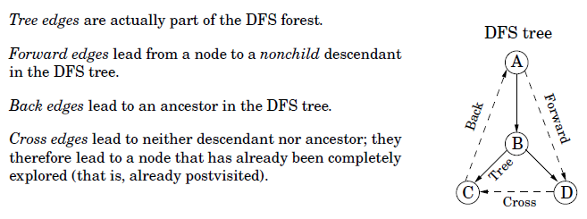
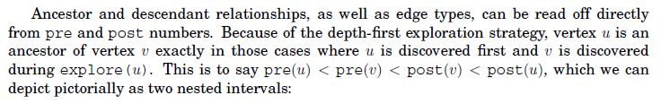
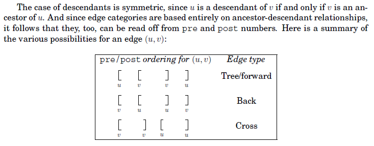

#### 3.3.2 Directed acyclic graphs

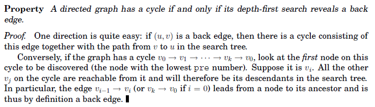
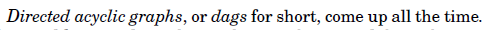
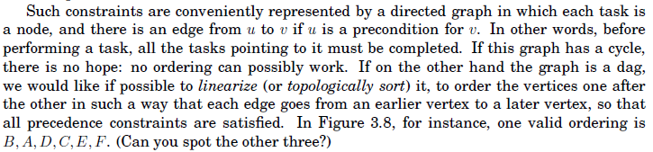
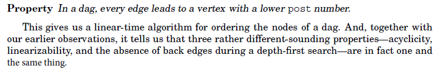
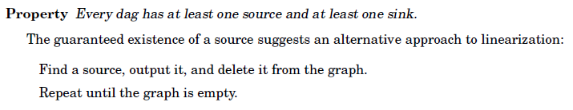

#### 3.4 Strongly connected components

#### 3.4.1 Defining connectivity for directed graphs

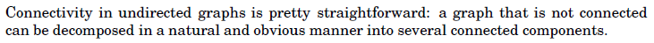
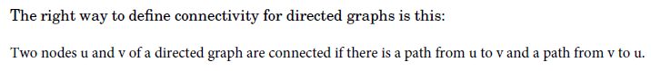
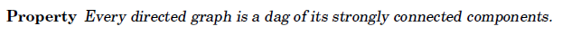
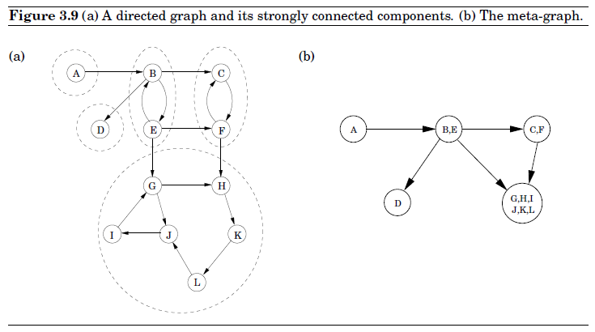

#### 3.4.2 An efficient algorithm

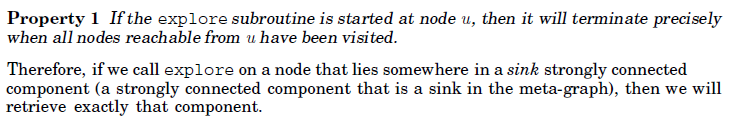
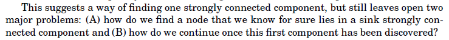
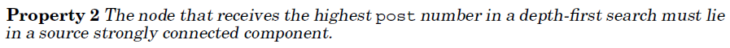
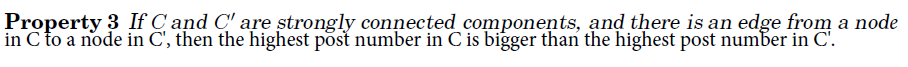
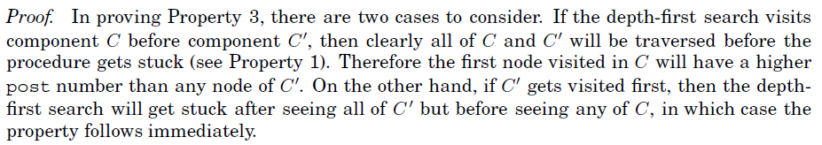
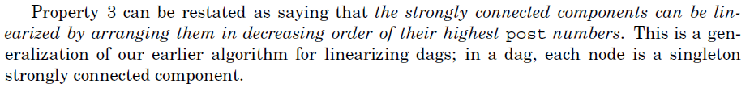
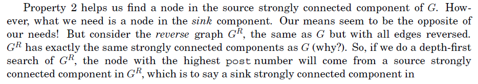
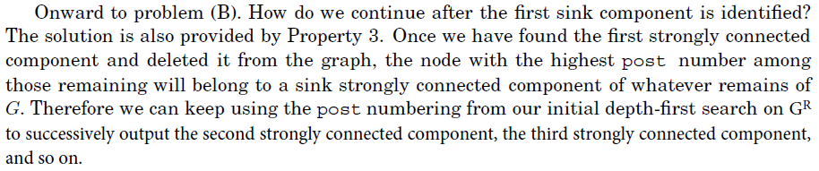
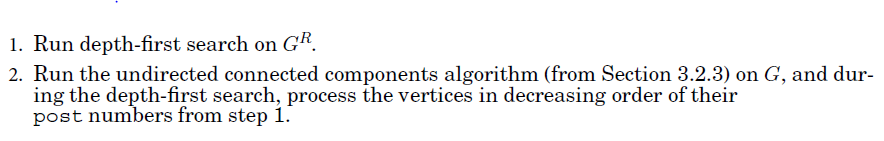
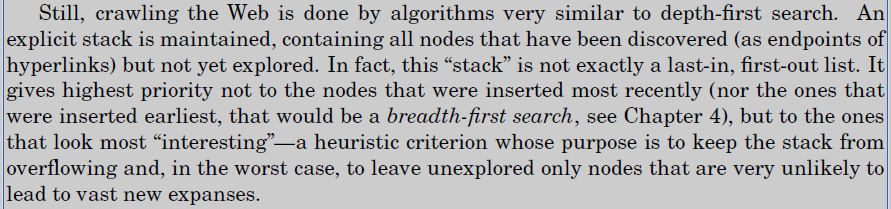
