## Decomposition of graphs

### 3.1 Why graphs?
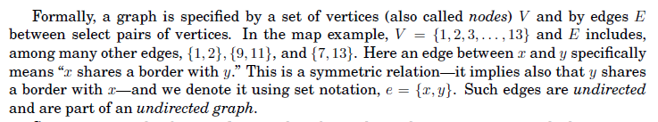

#### 3.1.1 How is a graph represented?

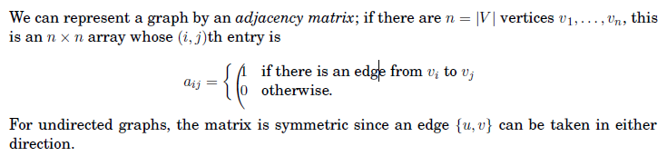
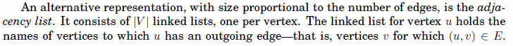

##### How big is your graph?

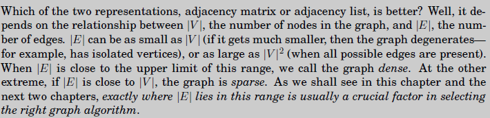
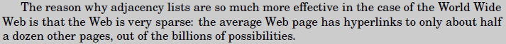

#### 3.2 Depth-first search in undirected graphs

#### 3.2.1 Exploring mazes

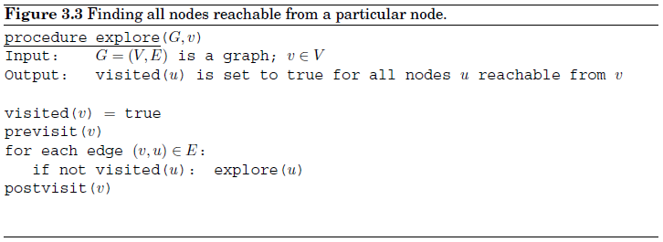

#### 3.2.2 Depth-first search

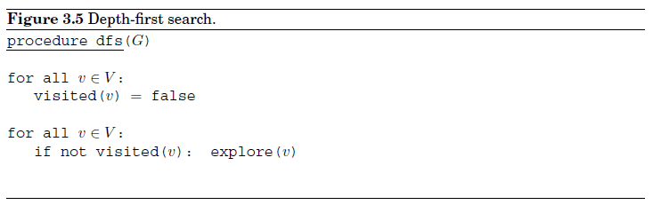

#### 3.2.3 Connectivity in undirected graphs

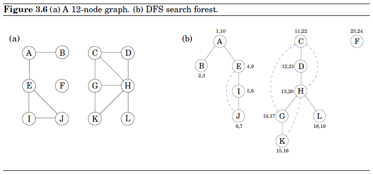
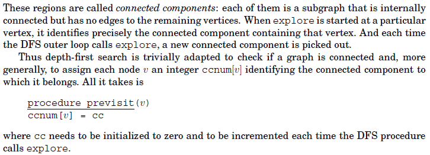

#### 3.2.4 Previsit and postvisit orderings

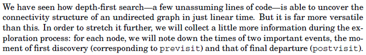
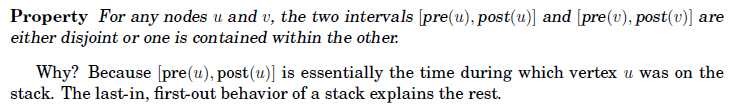

#### 3.3 Depth-first search in directed graphs

#### 3.3.1 Types of edges

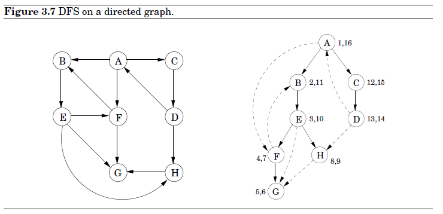

